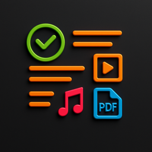

<div align="center">
  
  <h1>MustDo</h1>
  <p><strong>A native macOS app for everything you keep meaning to get to — sorted by what you'll actually do with it.</strong></p>
</div>

---

MustDo is a SwiftUI + SwiftData app that splits your "later" pile into four purpose-built lists instead of one undifferentiated todo dump:

| List | For | What it does |
|------|-----|--------------|
| ✅ **Must Do** | Plain tasks | Title + rich notes. |
| ▶️ **Must Watch** | Videos | Paste a YouTube / Twitter / video URL and download it for **offline** playback with bundled `yt-dlp`, or drag in local video files. Plays inline with AVKit. |
| 📖 **Must Read** | Articles & books | Paste a web URL (opens in an embedded browser), drag in **PDFs** (PDFKit), or **EPUBs** (built-in chapter reader). MOBI and other docs open in your default app. |
| 🎧 **Must Listen** | Podcasts & audio | Add a **podcast RSS feed** and it's parsed into a playable episode list, paste an audio URL, or drag in local audio files. |

Every list supports **drag-and-drop from Finder**, and files you add are **referenced in place** (not copied) so your library stays where you put it.

## Screenshots

> _Add screenshots to `docs/` and reference them here._

## Requirements

- macOS 26 (Tahoe) or later
- Xcode 26+ (to build from source)

## Install

Grab the latest `MustDo.dmg` from the [**Releases**](../../releases) page, open it, and drag **MustDo** to your Applications folder.

> The app is ad-hoc signed (no Developer ID), so on first launch macOS Gatekeeper may block it. Right-click the app → **Open**, or run:
> ```bash
> xattr -dr com.apple.quarantine /Applications/MustDo.app
> ```

## Build from source

```bash
git clone https://github.com/moerdowo/MustDo.git
cd MustDo

# Fetch the yt-dlp binary (not committed — ~36 MB). Required for Must Watch downloads.
./scripts/fetch_ytdlp.sh

open MustDo.xcodeproj   # then ⌘R
```

Or from the command line:

```bash
xcodebuild -project MustDo.xcodeproj -scheme MustDo -configuration Release build
```

## How it works

- **Storage** — SwiftData database in `~/Library/Application Support/com.moerdowo.MustDo/`. User files are stored as absolute paths; only app-generated media (yt-dlp downloads, thumbnails) is copied into the `Media/` subfolder.
- **Video download** — `yt-dlp` is bundled into the app's `Resources/` and invoked to fetch the best MP4 + thumbnail for offline viewing.
- **Podcasts** — a lightweight `XMLParser`-based RSS reader turns a feed URL into an episode list with `AVPlayer` playback.
- **EPUB** — unzipped to a temp dir, the OPF spine is parsed, and chapters are rendered in a `WKWebView` with prev/next navigation.

## Project layout

```
MustDo/
├── Models/        TodoItem, PodcastEpisode, MustCategory
├── Services/      MediaStore, YTDLPService, RSSParser, EPUBLoader, MetadataFetcher
├── Views/         Sidebar, per-category lists, detail/reader/player views
└── Resources/     yt-dlp (fetched on demand)
scripts/
└── fetch_ytdlp.sh
```

## License

MIT — see [LICENSE](LICENSE).
